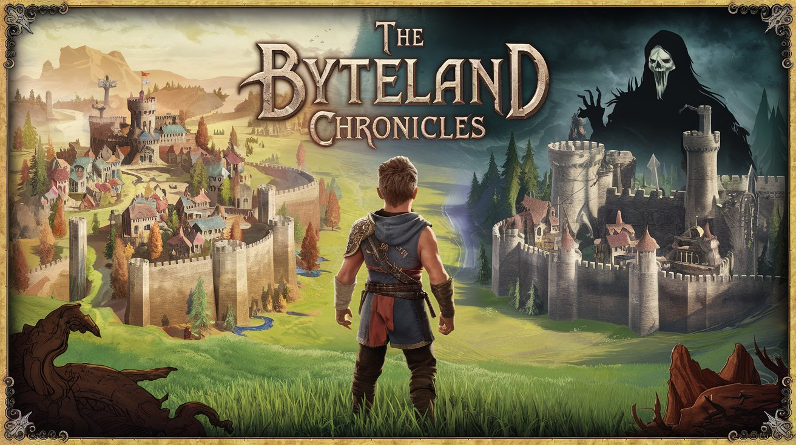

## Chapter 1 - Assault on Code's Kingdom

In the digital world of Byteland, a parallel universe made of codes, bytes, and data, peace has been maintained for centuries thanks to the balance between two fundamental powers: the Kingdom of Code and the Kingdom of Data. These two kingdoms have lived in harmony, each playing a crucial role in maintaining the stability and order of Byteland.

[Scaricalo da Google Play Store](https://play.google.com/store/apps/details?id=org.raffamax.the_byteland_chronicles_ep1)

